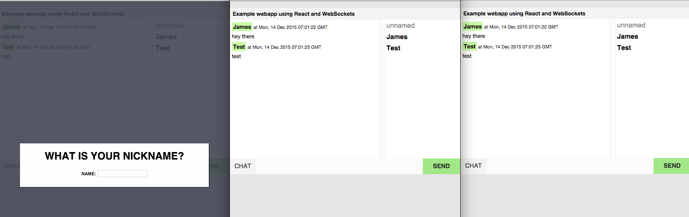

# :speech_balloon: react-websocket-chat

An example or starting place for an ES6 chat webapp using [Express](http://expressjs.com/en/index.html), [ws](https://github.com/websockets/ws), [React](https://facebook.github.io/react/), and [WebSockets](https://developer.mozilla.org/en-US/docs/Web/API/WebSockets_API).  

### Prerequisites

- [Node](https://nodejs.org/en/)
- webpack (`npm install -g webpack`)

### Setup

```
git clone https://github.com/jskz/react-websocket-chat.git test
cd test
npm install
```

### Build + Usage

```
webpack
npm start
```

Visit [http://localhost:8080/](http://localhost:8080/) with your browser.

### Screenshot with three sessions


